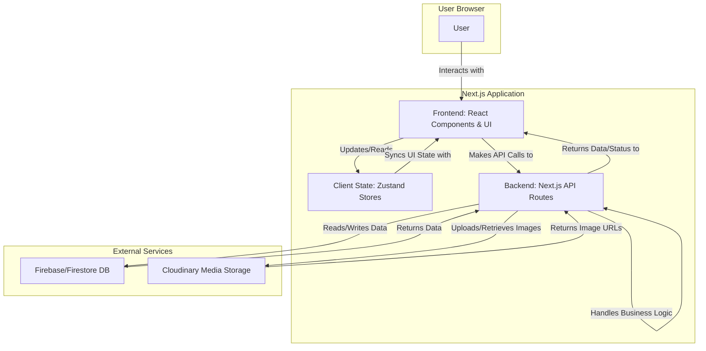

# Tech Hub - Project Architecture and Data Flow Documentation

This document provides a detailed overview of the Tech Hub e-commerce project, including its architecture, the technologies used, and the complete data flow.

## 1. Core Technologies & Tools

The project is built on a modern, full-stack TypeScript foundation.

- **Framework:** [Next.js](https://nextjs.org/) (with App Router) - Provides the foundation for server-side rendering, static site generation, and API routes.
- **Language:** [TypeScript](https://www.typescriptlang.org/) - For static typing and improved code quality.
- **Database:** [Firebase (Firestore)](https://firebase.google.com/docs/firestore) - A NoSQL cloud database used to store all application data, including users, products, orders, and reviews.
- **Image & Media Management:** [Cloudinary](https://cloudinary.com/) - Handles all image uploads, storage, optimization, and delivery.
- **Styling:** [Tailwind CSS](https://tailwindcss.com/) - A utility-first CSS framework for rapid UI development.
- **UI Components:** [shadcn/ui](https://ui.shadcn.com/) - A collection of reusable UI components built on top of Radix UI and Tailwind CSS.
- **Client-Side State Management:** [Zustand](https://github.com/pmndrs/zustand) - For managing client-side state like the shopping cart, user profile, and product comparison.
- **Rich Text Editing:** [Quill.js](https://quilljs.com/) - Used in the admin panel for creating and editing rich product descriptions.
- **Authentication:** Custom logic implemented via Next.js API routes, managing user sessions and protecting routes.
- **Email:** Custom implementation (`src/lib/email.ts`) for sending transactional emails (e.g., order confirmations).

## 2. Project Structure Overview

The codebase is organized logically to separate concerns.

- `src/app/`: The core of the Next.js application using the App Router.
  - `(pages)`: Contains all the user-facing pages (e.g., `home`, `product/[slug]`, `cart`, `admin`).
  - `api/`: Contains all backend API endpoints, which handle business logic, database interactions, and communication with external services.
- `src/components/`: Contains reusable React components used throughout the application (e.g., `ProductCard`, `Header`, `QuillEditor`).
  - `ui/`: Specifically for `shadcn/ui` components.
- `src/lib/`: Contains core service logic and initializations for external services.
  - `auth.ts`: Handles authentication logic.
  - `firebase-db.ts`: Contains functions for interacting with the Firestore database.
  - `cloudinary.ts`: Configures and initializes the Cloudinary SDK.
  - `email.ts`: Logic for sending emails.
- `src/store/`: Home to Zustand state management stores (`useCartStore`, `useProfileStore`, etc.).
- `public/`: Stores static assets like logos, icons, and placeholder images.
- `middleware.ts`: A Next.js middleware file, likely used for route protection (e.g., ensuring only authenticated users can access the `/profile` or `/admin` pages).

## 3. Data Flow Diagram (DFD)

This diagram illustrates the high-level flow of data between the user, the frontend, the backend API, and external services.

## 4. Detailed Data Flow Examples

### a. User Registration

1.  **Frontend:** The user fills out the registration form in the `SignupForm.tsx` component.
2.  **API Call:** On submission, the component calls the `/api/register` endpoint.
3.  **Backend (API Route):** The API route at `src/app/api/register/route.ts` receives the request.
4.  **Database Interaction:** It validates the user data and uses functions from `src/lib/firebase-db.ts` to create a new user document in the Firestore `users` collection.
5.  **Response:** The API route returns a success message and potentially a session token, which is then stored on the client to log the user in.

### b. Admin Adding a New Product (with Image Upload)

1.  **Frontend (Admin):** An admin user navigates to the admin dashboard, opens the "Add Product" form, and fills in the product details (name, price, etc.).
2.  **Image Selection:** The admin uses the `MultipleImagesUpload.tsx` or `DragDropUpload.tsx` component to select product images.
3.  **Image Upload API Call:** The component sends each image file to the `/api/upload-image` endpoint.
4.  **Backend (API Route) & Cloudinary:**
    - The `upload-image` route receives the file.
    - It uses the `src/lib/cloudinary-utils.ts` functions to stream the image data directly to **Cloudinary**.
    - Cloudinary saves the image, optimizes it, and returns a secure URL.
    - The API route sends this URL back to the frontend component.
5.  **Frontend State:** The component collects the returned image URLs in its state.
6.  **Product Creation API Call:** Once the form is complete and images are uploaded, the admin submits the form. This action calls the `/api/admin/products` endpoint with all product data, including the array of Cloudinary image URLs.
7.  **Backend (API Route) & Firebase:**
    - The `/api/admin/products` route receives the product data.
    - It validates the data and creates a new product document in the Firestore `products` collection, storing the text data and the Cloudinary image URLs.
8.  **Response:** The API returns a success status, and the admin UI updates to show the new product.

### c. User Viewing a Product Page

1.  **Navigation:** The user clicks on a product and navigates to a URL like `/product/cool-gadget`.
2.  **Frontend (Next.js Page):** The `src/app/product/[slug]/page.tsx` component is rendered.
3.  **Data Fetching:** The page component (either on the server via Server-Side Rendering or on the client) calls the `/api/products/[slug]` endpoint.
4.  **Backend (API Route) & Firebase:**
    - The API route queries the Firestore `products` collection for the document where the `slug` matches "cool-gadget".
    - It also fetches related data, like reviews from the `reviews` collection.
5.  **Response & Rendering:**
    - The API route returns a JSON object containing all the product details (name, price, description, and the **Cloudinary image URLs**).
    - The frontend component receives this data and renders the product information. The `` tags in the `ImageGallery.tsx` component use the Cloudinary URLs as their `src` attribute, causing the user's browser to fetch the images directly from Cloudinary's CDN.

### d. Adding an Item to the Cart

1.  **User Action:** The user clicks the "Add to Cart" button on a product page.
2.  **Client-Side State:** This action calls a function within the `ProductActions.tsx` component.
3.  **Zustand Store:** The component's function then calls an action from the `useCartStore` (`src/store/useCartStore.ts`), such as `addToCart`.
4.  **State Update:** The Zustand store updates its internal state, adding the product to the cart array. This process is entirely client-side and does not require an immediate API call.
5.  **UI Update:** Because the `Header` and `Cart` page components are subscribed to the `useCartStore`, they automatically re-render to reflect the new state (e.g., the cart icon shows an updated item count).

## 5. Role of External Services

- **Firebase/Firestore:**
  - **Role:** Primary Database (Backend).
  - **Function:** Acts as the single source of truth for all structured data. It stores collections for:
    - `users`: User accounts, profiles, and roles (e.g., `admin`).
    - `products`: All product information, including descriptions, pricing, stock levels, and URLs to images on Cloudinary.
    - `orders`: Records of all customer orders, including items purchased, shipping details, and payment status.
    - `categories`, `reviews`, `returns`, `wishlists`: Other e-commerce related data models.
  - **Interaction:** The Next.js backend API is the only part of the system that communicates directly with Firebase, ensuring data integrity and security.

- **Cloudinary:**
  - **Role:** Media Asset Management.
  - **Function:** Offloads the storage and delivery of all images. Its key responsibilities are:
    - **Storage:** Securely stores all uploaded product images.
    - **Transformation & Optimization:** Can automatically resize, crop, and optimize images for web delivery, reducing load times.
    - **Delivery (CDN):** Delivers images to users globally via a Content Delivery Network (CDN), ensuring fast load times regardless of user location.
  - **Interaction:** The backend API (`/api/upload-image`) handles the upload process. The frontend receives only the final Cloudinary URL and uses it to display images. This means the application server doesn't have to handle the bandwidth load of serving images.
